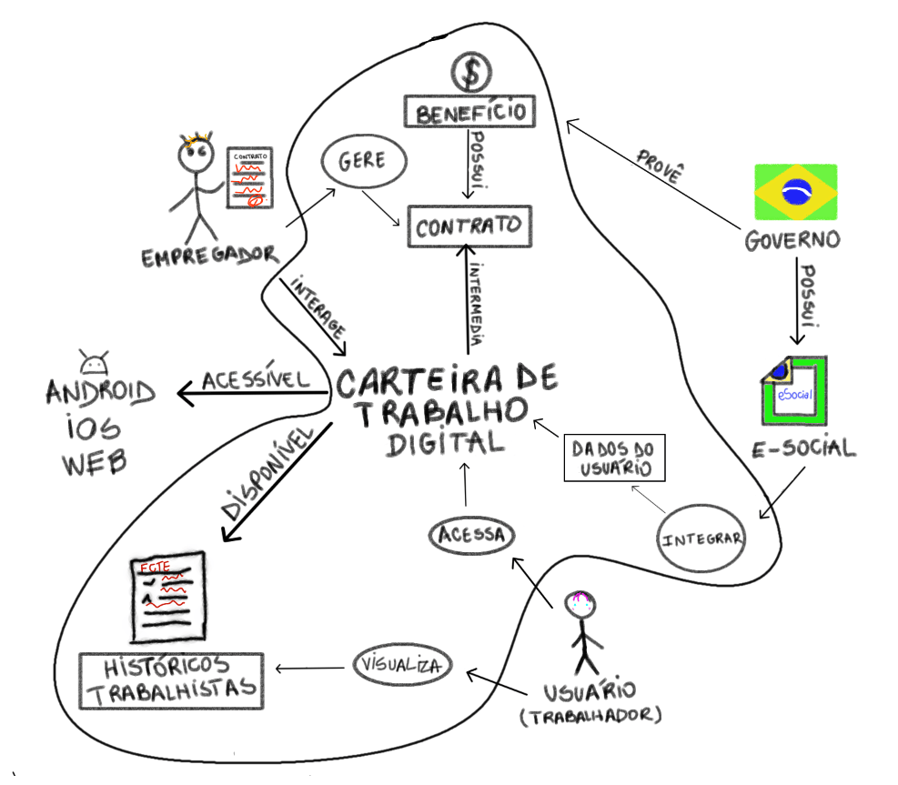

# Aplicativo Escolhido

## Introdução

Este documento descreve o processo realizado pela equipe para escolher o aplicativo **Carteira de Trabalho Digital**, ferramenta que facilita o acesso e o gerenciamento das informações trabalhistas, para o desenvolvimento do projeto. A decisão foi baseada em critérios estabelecidos pelo time e pelo professor, levando em conta diversos aspectos que são abordados nesse texto. Além disso, explica as motivações que justificaram a escolha do software, descrevendo as fases metodológicas utilizadas para a seleção do mesmo, tal como discorre sobre o sistema.

## Metodologia
O processo de escolha foi conduzido em duas etapas:
- Primeiramente, em uma reunião na plataforma [Microsoft Teams](https://teams.microsoft.com), foram apresentados os *rich pictures* dos [aplicativos em análise](), permitindo uma discussão sobre suas funcionalidades. 
- Em seguida, uma enquete foi realizada no [Telegram](https://telegram.org/) para coletar as preferências dos participantes, considerando os fatores descritos ao decorrer desta documentação.

## Critérios
* Não ter sido trabalhado na disciplina de Requisitos de Software anteriormente.
* Precisa ser um software livre, como muitos do governo.
* Nível de complexidade do aplicativo.
* Facilidade de interação com o público-alvo.
* Acessibilidade e disponibilidade de informações.

## Motivações 
Considerando os critérios definidos, o grupo decidiu seguir o projeto com a Carteira Digital do Trabalho, apoiado pelos seguintes fatores:
* A oportunidade de uma análise mais profunda e uma nova abordagem dentro do contexto da matéria.
* A facilidade de comunicação com os usuários, o que facilita a coleta de feedback.
* A diversidade de funcionalidades do aplicativo, que permite um estudo completo, sem ser complexo demais a ponto de exigir muitos requisitos, nem tão simples que limite a análise.
* A estrutura governamental do software, que oferece canais de contato úteis para validação dos requisitos.

## Carteira de Trabalho Digital
A **Carteira Digital de Trabalho** tem como objetivo facilitar o acesso do cidadão aos principais serviços empregatícios, oferecendo praticidade e agilidade. O aplicativo oferece uma série de funcionalidades essenciais, como:
* Consulta ao histórico de vínculos laborais.
* Acompanhamento das contribuições para o INSS.
* Emissão de certidões e comprovantes de situação de trabalho.

Ademais, possibilita a realização de diversas operações, que antes exigiam deslocamento físico, como:
* Acesso à versão digital da carteira de trabalho.
* Solicitação de benefícios.
* Consulta ao saldo e extrato do FGTS.
* Atualização de dados cadastrais.

A página do aplicativo está disponível para download na [Play Store](https://play.google.com/store/apps/details?id=br.gov.dataprev.carteiradigital&hl=pt_BR) e na [App Store](https://apps.apple.com/br/app/carteira-de-trabalho-digital/id1295257499).

## Rich Picture do Aplicativo
O Rich Picture é uma representação visual que ajuda a entender e comunicar um problema ou sistema de forma simples. Ele mapeia partes envolvidas, como pessoas e processos, e também pode ser utilizado para identificar e representar requisitos, destacando funcionalidades, restrições e interações. Com isso, facilita a interpretação e a comunicação, sendo especialmente útil durante o levantamento dos requisitos.
Na figura 1, é possível visualizar a primeira versão da Rich Picture feita para o nosso aplicativo.

    Figura 1: Carteira de Trabalho Digital, Rich Picture. (Fonte: Autor, 2025).

### Legenda

| Atores | Operações | Tabelas | Setas | Limites do Sistema |
|--------|-----------|---------|-------|--------------------|
||||||

    Tabela 1: Legenda da Rich Picture. (Fonte: Autor, 2025).

## Conclusão
A **Carteira de Trabalho Digital** foi a aplicação selecionada com base em parâmetros objetivos. Por meio de uma abordagem colaborativa e estruturada, a decisão foi tomada de forma conjunta, garantindo que o aplicativo atendesse às necessidades do projeto e de seus participantes.

## Bibliografia
>MINISTÉRIO DO TRABALHO E PREVIDÊNCIA. Carteira de Trabalho Digital. Disponível em: https://www.gov.br/pt-br/servicos/carteira-de-trabalho-digital. Acesso em: 10 abr. 2025.

> Rich Picture Guidelines, Software Development.

## Histórico de Versão
| Versão | Data       | Descrição                   | Autor             | Revisor         |
|--------|------------|-----------------------------|-------------------|-----------------|
| 1.0    | 10/04/2025 | Criação do documento        | [Amanda Cruz Lima](https://github.com/mandicrz) |  
