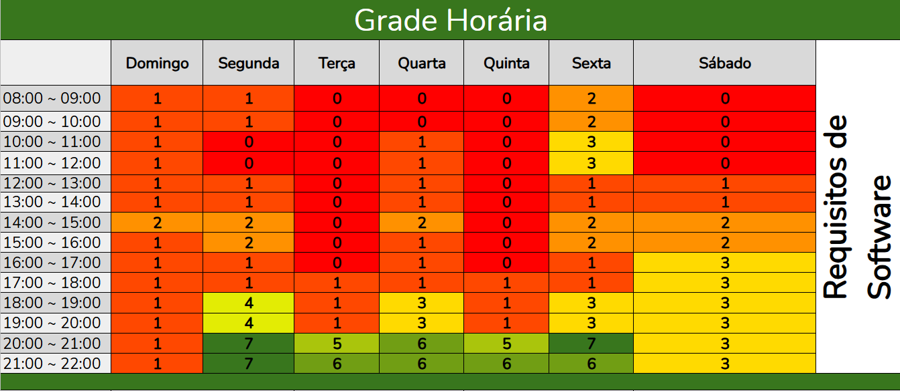

# Heatmap de Disponibilidade

## Introdução

O **heatmap de disponibilidade** é uma ferramenta visual essencial para equipes que buscam otimizar a coordenação e maximizar a produtividade. Ele permite identificar de forma rápida e eficiente os horários e dias em que os membros da equipe estão disponíveis para colaborar. Em contextos de trabalho flexível, especialmente em equipes remotas ou distribuídas, essa ferramenta se torna ainda mais relevante para facilitar a organização de tarefas, reuniões e atividades colaborativas. Ao consolidar as informações de disponibilidade dos integrantes, o heatmap oferece insights valiosos para uma melhor alocação de tempo e recursos, promovendo decisões mais ágeis e eficazes.

### Objetivo

O objetivo principal do heatmap de disponibilidade é maximizar a colaboração e a produtividade da equipe, proporcionando uma visão clara dos momentos em que todos os membros estão disponíveis simultaneamente. Essa visão facilita a organização de reuniões, sessões de brainstorming e outras atividades cruciais para o sucesso do projeto.

## Heatmap

A Tabela 1 e a Figura 1 ilustram o mapeamento de disponibilidade. Cada número, variando de 0 a 7, representa a quantidade de membros disponíveis em determinado dia e horário.

  
    
<b>Figura 1:</b> Heatmap de disponibilidade

  

  

  
    
<b>Fonte:</b> João Pedro Costa, 2025

  

  
    
<b>Tabela 1:</b> Heatmap de disponibilidade

  

  <table border="1" cellpadding="5">
    <thead>
      <tr>
        <th>Hora</th>
        <th>Domingo</th>
        <th>Segunda</th>
        <th>Terça</th>
        <th>Quarta</th>
        <th>Quinta</th>
        <th>Sexta</th>
        <th>Sábado</th>
      </tr>
    </thead>
    <tbody>
      <tr>
        <td>08:00~09:00</td>
        <td>1</td>
        <td>1</td>
        <td>0</td>
        <td>0</td>
        <td>0</td>
        <td>2</td>
        <td>0</td>
      </tr>
      <tr>
        <td>09:00~10:00</td>
        <td>1</td>
        <td>1</td>
        <td>0</td>
        <td>0</td>
        <td>0</td>
        <td>2</td>
        <td>0</td>
      </tr>
      <tr>
        <td>10:00~11:00</td>
        <td>1</td>
        <td>0</td>
        <td>0</td>
        <td>1</td>
        <td>0</td>
        <td>3</td>
        <td>0</td>
      </tr>
      <tr>
        <td>11:00~12:00</td>
        <td>1</td>
        <td>0</td>
        <td>0</td>
        <td>1</td>
        <td>0</td>
        <td>3</td>
        <td>0</td>
      </tr>
      <tr>
        <td>12:00~13:00</td>
        <td>1</td>
        <td>1</td>
        <td>0</td>
        <td>1</td>
        <td>0</td>
        <td>1</td>
        <td>1</td>
      </tr>
      <tr>
        <td>13:00~14:00</td>
        <td>1</td>
        <td>1</td>
        <td>0</td>
        <td>1</td>
        <td>0</td>
        <td>1</td>
        <td>1</td>
      </tr>
      <tr>
        <td>14:00~15:00</td>
        <td>2</td>
        <td>2</td>
        <td>0</td>
        <td>2</td>
        <td>0</td>
        <td>2</td>
        <td>2</td>
      </tr>
      <tr>
        <td>15:00~16:00</td>
        <td>1</td>
        <td>2</td>
        <td>0</td>
        <td>1</td>
        <td>0</td>
        <td>2</td>
        <td>2</td>
      </tr>
      <tr>
        <td>16:00~17:00</td>
        <td>1</td>
        <td>1</td>
        <td>0</td>
        <td>1</td>
        <td>0</td>
        <td>1</td>
        <td>3</td>
      </tr>
      <tr>
        <td>17:00~18:00</td>
        <td>1</td>
        <td>1</td>
        <td>1</td>
        <td>1</td>
        <td>1</td>
        <td>1</td>
        <td>3</td>
      </tr>
      <tr>
        <td>18:00~19:00</td>
        <td>1</td>
        <td>4</td>
        <td>1</td>
        <td>3</td>
        <td>1</td>
        <td>3</td>
        <td>3</td>
      </tr>
      <tr>
        <td>19:00~20:00</td>
        <td>1</td>
        <td>4</td>
        <td>1</td>
        <td>3</td>
        <td>1</td>
        <td>3</td>
        <td>3</td>
      </tr>
      <tr>
        <td>20:00~21:00</td>
        <td>1</td>
        <td>7</td>
        <td>5</td>
        <td>6</td>
        <td>5</td>
        <td>7</td>
        <td>3</td>
      </tr>
      <tr>
        <td>21:00~22:00</td>
        <td>1</td>
        <td>7</td>
        <td>6</td>
        <td>6</td>
        <td>6</td>
        <td>6</td>
        <td>3</td>
      </tr>
    </tbody>
  </table>

  
    
<b>Fonte:</b> João Pedro Costa, 2025

  

## Bibliografia
> ANTHROPIC. Claude [software]. Versão 3.7 Sonnet. San Francisco: Anthropic, 2025. Disponível em: https://claude.ai. Acesso em: 08/04/2025.

## Links
Acesso do heatmap no excel: [Heatmap](https://unbbr-my.sharepoint.com/:x:/g/personal/190030801_aluno_unb_br/EUKiqFx1MyZGl9xkZT1Jp30BZzv4c6Dz-HJzjKcvLTHu3A?e=hnYyOw)

| Versão | Data       | Descrição                   | Autor             | Revisor         |
|--------|------------|-----------------------------|-------------------|-----------------|
| 1.0    | 08/04/2025 | Criação da pagina do heatmap           | João Pedro Costa | Julia Gabriela |